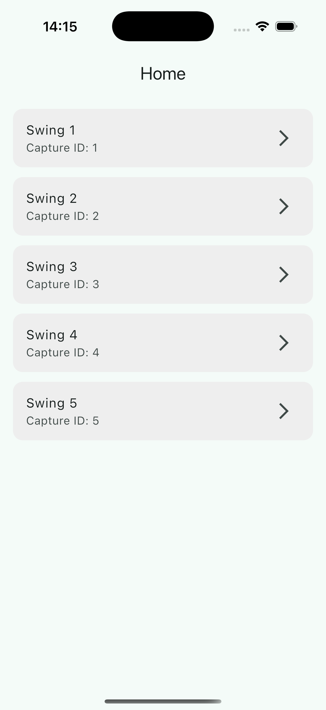
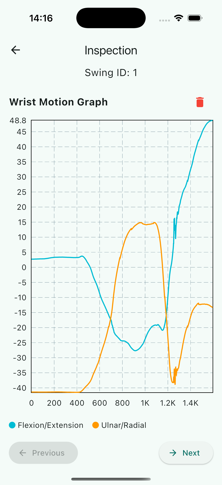

# 🏌️‍♂️ Swing Scope

**Swing Scope** is a modern, cross-platform Flutter application designed to visualize wrist motion data captured during golf swings. It processes motion data from JSON files and renders smooth line charts for **flexion/extension** and **ulnar/radial deviation** across time.

The app is user-friendly, responsive on both Android and iOS, and allows easy inspection and management of recorded swing sessions.

---

## 🚀 Key Features

- 📋 **Home Page**: View a scrollable list of available swing recordings.
- 📈 **Inspection Page**: Inspect selected swing data visually with dynamic charts.
- 🔁 **Navigation**: Jump between swings using Previous and Next controls.
- 🗑️ **Delete Function**: Remove individual swing recordings with one tap.
- 📊 **Line Graphs**: Time-series charts for both flexion/extension and ulnar/radial deviation.
- 🧭 **Responsive UI**: Optimized for both Android and iOS platforms.
- 🧩 **Custom App Icon**: Branded icon integrated for both Android and iOS.

---

## 🧠 State Management

Swing Scope uses **Cubit** (via the [`flutter_bloc`](https://pub.dev/packages/flutter_bloc) package) to handle:

- Loading swing data from JSON files
- Navigating between swings
- Managing selection and deletion state

### Why Cubit?
- Simple and lightweight
- Perfect for handling straightforward app states
- Keeps logic separate from UI

---

## 📦 Libraries Used

| Package          | Purpose                                                                                  |
|------------------|------------------------------------------------------------------------------------------|
| `flutter_bloc`   | State management using Cubit architecture.                                               |
| `fl_chart`       | Graph rendering for time-series swing motion data.                                       |
| `path_provider`  | Accessing local file system directories.                                                 |

---

### 📁 Directory Layout

```
lib/
├── main.dart
├── models/              # SwingCapture model
├── cubit/               # Cubit and states for managing swing data
├── pages/               # HomePage and InspectionPage UI
├── widgets/             # Custom widgets like graph viewer
├── utils/               # JSON loader functions
assets/
└── swings/              # JSON swing capture files (1.json, 2.json, ...)
```

---

## 🛠 Setup Instructions

1. Clone the repo:
   ```bash
   git clone https://github.com/sunalii/lv-hackmotion-swing-scope.git
   cd lv-hackmotion-swing-scope
   
2. Install dependencies:
   ```bash
   flutter pub get
   
3. Run the app:
   ```bash
   flutter run

© 2025 Sunali Rambukwella. All rights reserved.

## 📱 Screenshots

